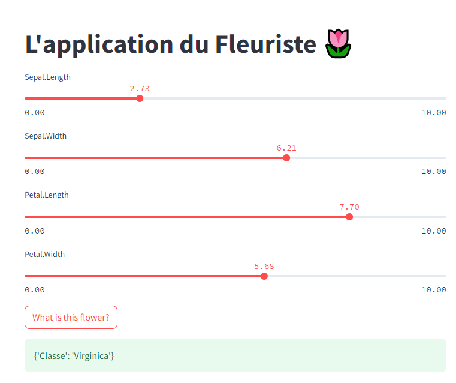

# Application de Machine Learning avec Streamlit/FastAPI/Docker


<span style="color:red;font-weight:bold;">Cette application permet de prédire l'espèce d'une Iris à partir de ses dimensions</span>

On met en relation une partie BackEnd composée d'un modèle de *Régression logistique* ayant appris sur le dataset **Iris** avec un FrontEnd dans lequel on peut rentrer des valeurs sur les dimensions de l'Iris (Petal length and width & Sepal length and width) à travers une API.



Attention, il est important d'avoir **Docker Desktop** ouvert. Pour lancer l'application, il est nécessaire de lancer la ligne de commande suivante à l'emplacement où se trouve notre fichier **docker-compose.yml**:

```
docker-compose up --build
```

Cette ligne nous permet d'assembler les différents containers ensemble pour ainsi pouvoir faire communiquer notre FrontEnd et notre BackEnd/Middleware ensemble, c'est-à-dire, que la commande va assembler le container de notre partie **server** (notre modèle exporté en joblib et notre API) et le container de notre partie **server** (notre FrontEnd). Une fois que cela est lancé, il est nécessaire de rejoindre l'adresse où se trouve notre FrontEnd pour pouvoir intéragir avec: [http://localhost:8501/](http://localhost:8501/).


 Une fois que vous avez fini d'utiliser l'application, rentrez la ligne de commande suivante au même endroit où se trouve notre fichier **docker-compose.yml**:

```
docker-compose down
```